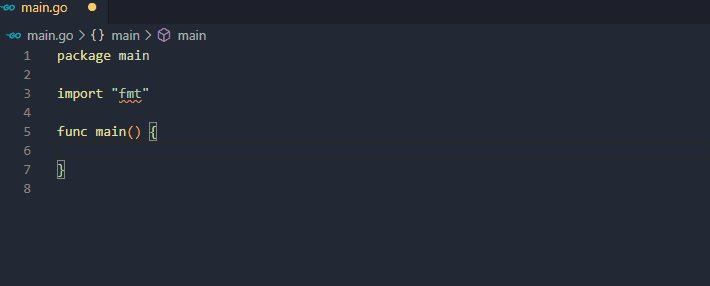
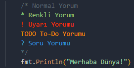

- [Pratik Bilgiler](#pratik-bilgiler)
	- [Go Geliştiricileri için Makefile](#go-geliştiricileri-için-makefile)
	- [Derleme \(Build\) Detayını Görme](#derleme-build-detayını-görme)
	- [Visual Studio Code için Golang Özelleştirmeleri](#visual-studio-code-için-golang-özelleştirmeleri)
		- [Canlı Hata Ayıklama](#canlı-hata-ayıklama)
		- [Go Yazarken Kullanabileceğiniz VSCode Eklentileri](#go-yazarken-kullanabileceğiniz-vscode-eklentileri)
			- [ErrorLens](#errorlens)
			- [Better Comments](#better-comments)
	- [İşletim Sistemini Görme](#i̇şletim-sistemini-görme)

# Pratik Bilgiler

## Go Geliştiricileri için Makefile

Golang ile yazılım geliştirirken **Makefile** teknolojisinde nasıl faydalanacağımızı göreceğiz. Gözümüzün korkmasına gerek yok, aşırı basit bir olay. Zaten herşeyi biliyorsunuz. Makefile sadece bir yöntemdir.  
 

**Makefile Nedir?**

**Makefile**, çoğu komutu çalıştırmak için kullanabileceğimiz otomasyon aracıdır. Makefile’ı genellikle Github veya Gitlab’de programların ana dizininde bazı işlemleri otomatikleştirme için kullanıldığını görebilirsiniz.  
 

**Basit Bir Örnek**

Bir proje klasörü oluşturalım ve bu klasörün içine **makefile** adında dosya oluşturalım. Daha sonra makefile dosyamızı herhangi bir editör ile açalım ve içerisine aşağıdakileri yazalım.

```python
merhaba:
    echo "merhaba"
```

Gördüğünüz gibi programlama dillerine ve komutlara benzer bir yazılımı var.  
Kodumuzu **make** komutu ile deneyebiliriz. Proje klasörümüzün içerisinde komut satırına **make merhaba** yazarak kodumuzun çıktısını görelim:

> echo "Merhaba"  
> Merhaba

Gördüğünüz gibi **make** komutunun yanına **merhaba** ekleyerek **makefile** dosyamızdaki merhaba bölümünün çalışmasını sağladık. Makefile’ın genel mantığına baktığımızda komut satırı üzerinden yaptığımız işlemleri kısaltıyor.  
 

**Basit Go Uygulaması İnşa Etme**

```go
package main
import "fmt"
func main() {
	fmt.Println("Merhaba")
}
```

Yukarıda gördüğünüz gibi basit bir Go uygulamamız var. Şimdi bu Go dosyamız ile işlem yapabilmek için **makefile** dosyamıza komutlar girelim.

```python
merhaba:
	echo "Merhaba"
build:
	go build main.go
run:
	go run main.go
```

Yukarıda gördüğünüz gibi **makefile** dosyamıza bloklar açarak bildiğiniz komut satırı komutlarını girdik. Yukarıdaki kodların durumuna göre **make build** ile Go dosyamızı build ederiz ve **make run** ile Go dosyamızı çalıştırırız. Gayet basit bir mantığı var.

**Peki bu olay bizim ne işimize yarayacak?**

Örneğin bir projeyi 3 tane platform için build etmemiz gerekecek. Her platform için ayrı Go Ortamı bilgisi girmemiz gerekir. Hele ki build işlemini sürekli yapıyorsanız bu işten bıkabilirsiniz. Fakat makefile dosyasıyla işinizi kolaylaştırabilirsiniz.  
Örneğimizi görelim:

```python
derle:
	echo "Windows, Linux ve MacOS için Derleme İşlemi"
	GOOS=windows GOARCH=amd64 go build -o bin/main-windows64.exe main.go
	GOOS=linux GOARCH=amd64 go build -o bin/main-linux64 main.go
	GOOS=darwin GOARCH=amd64 go build -o bin/main-macos64 main.go
run:
	go run main.go
hepsi: derle run
```

**derle** bloğumuzun içerisine 3 platforma derlemek için komutlarımızı girdik. **run** bloğuna ise **main.go** dosyamızı çalıştırmak için komutumuzu girdik. **hepsi** bloğunun yanına ise **derle** ve **run** yazdık. Yani komut satırına **make hepsi** yazarsak hem derleme hem de çalıştırma işlemini yapacak.  
   
Bu yazımızda **Golang için** **makefile** kullanımına örnek verdik. İlla ki Go’da kullanılacak diye bir kaide yok. Diğer programlama dillerinde veya komutlarınızı otomatize etmek istediğiniz zaman kullanabilirsiniz.

## Derleme \(Build\) Detayını Görme

Golang’de normalde derleme işlemini yapmak için go build komutunu kullanırız. Bu komut terminal ekranından bize sadece bir hata olduğunda bilgi verir. Hata yoksa çalıştırılabilir dosyayı zaten oluşturur.  
 

**Peki programımızın derlenme esnasında bilgilendirmeyi nasıl görebiliriz?**

İşte aşağıdaki gibi:

> go build -gcflags=-m main.go

Yani build’e ek parametre olarak **-gcflags=-m** yazıyoruz. Nasıl gözüktüğünü örnek olarak görelim.

```go
package main
import (
    "fmt"
    "os"
)
func main() {
        fmt.Println("Merhaba")
    fmt.Println(topla(2,2))
    os.Exit(0)
}
func topla(x,y int) int{
    return x + y
}
```

Yukarıdaki kodumuzun derleme çıktısı şöyle olacaktır.

> command-line-arguments  
> ./main.go:13:6: can inline topla  
> ./main.go:9:13: inlining call to fmt.Println  
> ./main.go:10:22: inlining call to topla  
> ./main.go:10:16: inlining call to fmt.Println  
> ./main.go:9:14: "Merhaba" escapes to heap  
> ./main.go:9:13: io.Writer\(os.Stdout\) escapes to heap  
> ./main.go:10:16: io.Writer\(os.Stdout\) escapes to heap  
> ./main.go:10:22: topla\(2, 2\) escapes to heap  
> ./main.go:9:13: main \[\]interface {} literal does not escape  
> ./main.go:10:16: main \[\]interface {} literal does not escape  
> :1: os.\(\*File\).close .this does not escape

## Visual Studio Code için Golang Özelleştirmeleri

Bu yazıda Visual Studio Code üzerinde Golang için kullanabileceğimiz özelleştirmelerden bahsedeceğiz. Bu özelleştirmeler sayeseinde kod yazma deneyimimizi iyileştirebiliriz.

### Canlı Hata Ayıklama

VSCode üzerinde Go dili kodları yazarken farketmişsinizdir. Kodu yazarken hata ayıklamıyor. Sadece dosyayı kaydettiğimizde hata ayıklama işlemi yapıyor. Kod üzerinde canlı hata ayıklamayı aktif etmemiz gerekiyor. Bunun için;

`CTRL + SHIFT + P` tuşlarına beraber basarak, VSCode komut bölümünü açalım. Bu kısma `"Preferences: Open User Settings"` yazalım ve çıkan ilk sonuca girelim.


Açılan `Settings` sekmesinde üst tarafta bulunan arama yapma kutusuna `"Go: Live Errors"` yazalım. Çıkan sonuçta `"Edit in settings.json"` bağlantısına tıklayalım.


```javascript
"go.liveErrors": {
    "enabled": false, //Burayı true yapalım.
    "delay": 500 //tepki süresi
}
```

Açılan editörde `"go.liveErrors"` anahtarının karşısında ayarlarımız var. `"enabled"` anahtarının değerini `true` yapalım. `"delay"` anahtarındaki değerde ise yazdıktan kaç milisaniye sonra hata ayıklama yapacağını belirtiyoruz. `500` \(yarım saniye\) normal bir değerdir.

Daha sonra bir `.go` dosyası oluşturalım veya hali hazırda `.go` dosyasını açalım. Açtığımız dosyanın içerisine birşeyler yazmaya çalıştığımızda VSCode'un sağ alt köşesinde bir uyarı verecektir. Bu uyarıda **Install** butonuna tıklayarak eklenti yükleme işlemini başlatalım. Bu eklenti canlı hata ayıklama yapmak için gereklidir. Yüklendiğinde **Output** sekmesinde aşağıdakine benzer bir sonuç alacaksınız.

> Tools environment: GOPATH=C:\Users\kaank\go Installing 1 tool at C:\Users\kaank\go\bin in module mode. gotype-live  
>   
> Installing github.com/tylerb/gotype-live \(C:\Users\kaank\go\bin\gotype-live.exe\) SUCCEEDED  
>   
> All tools successfully installed. You are ready to Go :\).

Artık canlı hata ayıklama özelliğini kullanabilirsiniz.



### Go Yazarken Kullanabileceğiniz VSCode Eklentileri

#### ErrorLens

Bu eklenti ile kod yazarken eğer hata varsa alakalı satırın sağında hata mesajını görebilirsiniz. Bu eklentiyi Go için kullanmadan önce Go için canlı hata ayıklamayı açmanızı tavsiye ederim _\(Yukarıda gösterdim\)_.


#### Better Comments

Yorum satırlarını daha şık gösteren bir eklentidir. Tavsiye ederim. Satırın başına koyduğunuz işaret veya yazdığınız yazıya göre satırın rengi değişiyor.




## İşletim Sistemini Görme

Go programının çalıştığı işletim sistemi görmek için aşağıdaki kodları yazabilirsiniz.

```go
package main

import (
	"fmt"
	"runtime"
)

func main() {

	if r := runtime.GOOS; r == "windows" {
		fmt.Println("Windows için yönerici olarak çalıştırın.")
	} else if r == "linux" {
		fmt.Println("Linux için sudo komutu ile çalıştırın.")
	} else {
		fmt.Println("Geçersiz işletim sistemi!")
	}
}
```

GNU/Linux kullandığım için çıktım aşağıdaki gibi olacaktır.

> Linux için sudo komutu ile çalıştırın.

